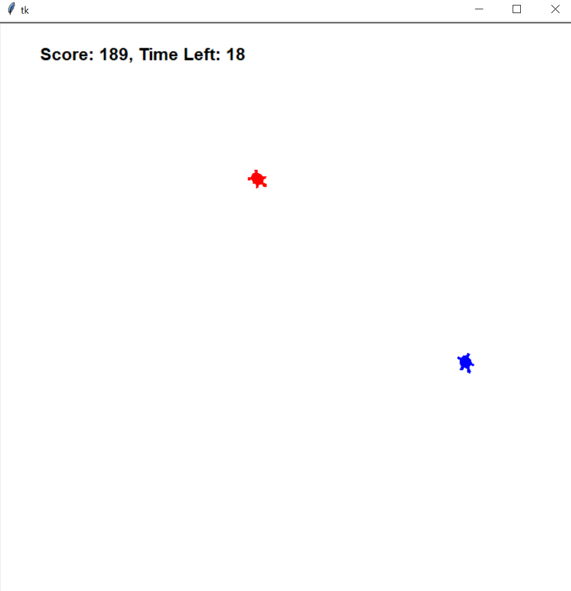

# Runaway Turtle Game

## 개요
이 프로젝트는 파이썬의 `turtle` 모듈을 이용한 간단한 추격 게임입니다.
플레이어는 **수동으로 조작하는 거북이**(runner)를 조종하고, 인공지능이 조종하는 **추격자 거북이**(chaser)로부터 도망가야 합니다.
게임에는 타이머, 점수 시스템, 그리고 추격 알고리즘이 포함되어 있습니다.

## 주요 기능
1. **수동 조작**: 플레이어는 화살표 키를 사용해 `runner`를 직접 조종합니다.
2. **인공지능 추격자**: `chaser`는 자동으로 `runner`의 위치를 추적합니다.
3. **점수 시스템**: `runner`가 잡히지 않고 도망가면 점수가 증가합니다. 잡히면 점수는 0으로 리셋됩니다.
4. **타이머**: 60초 동안 게임이 진행되며, 시간이 끝나면 게임이 종료됩니다.

## 파일 구조
- turtle_runaway.py: 게임의 메인 코드.
- turtle_runaway.md: 코드 설명 및 사용법.

## 코드 설명
- **ManualMover**: 플레이어가 직접 조종할 수 있는 거북이(runner)입니다.
- **IntelligentChaser**: 자동으로 `runner`를 추적하는 인공지능 거북이(chaser)입니다.
- **RunawayGame**: 게임 로직을 관리합니다. 타이머와 점수 시스템이 포함되어 있습니다.

## 이미지

